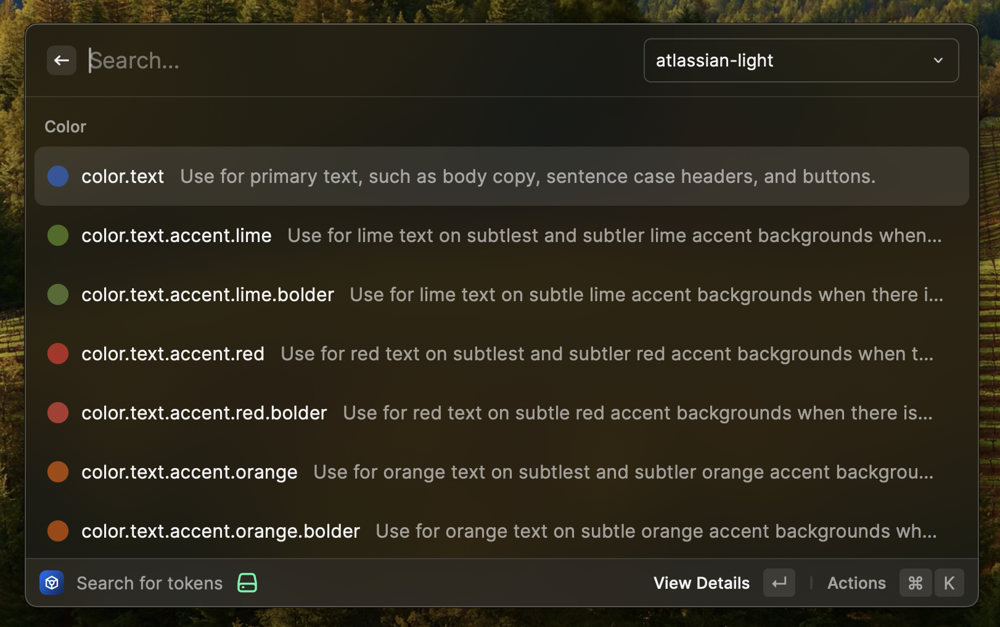
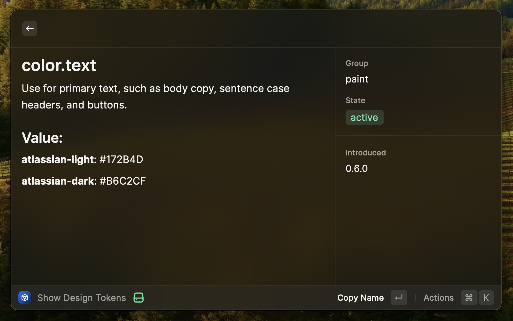

# Atlassian Design Tokens

A Raycast plugin to enable quick searching of Atlassian design tokens, including reading descriptions and other metadata.

## Features

- List of color, spacing, typography and shape tokens from the Atlassian Design System
- Quick actions to copy name, code (`token()` calls), and values
- Detail pane with token description, state and other metadata

